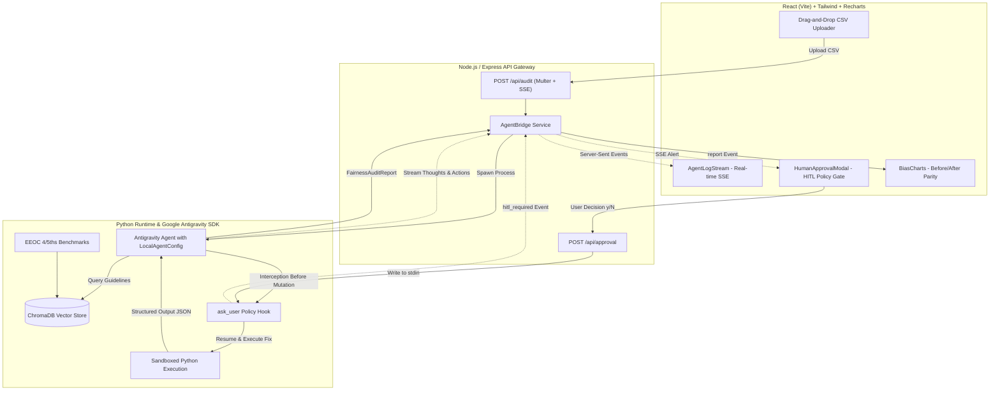

# Autonomous AI Fairness & Bias Auditor

An agent-driven algorithmic governance platform that audits tabular datasets for demographic disparities and regulatory violations (such as the EEOC Four-Fifths rule), retrieves ethical benchmarks via a local RAG vector store, and applies sandboxed data remediations with strict **Human-in-the-Loop (HITL)** policy controls.

---

## 🏛️ System Architecture



---

## 🚀 Key Google Antigravity SDK Implementations

1. **`LocalAgentConfig`**: Gives the autonomous agent secure terminal and File I/O access to inspect tabular CSV files and write remediation scripts in local sandboxes.
2. **Strict Structured Output**: Enforces the agent's final diagnostic output into a typed Pydantic schema (`FairnessAuditReport`) seamlessly consumed by the React/Recharts frontend.
3. **Human-in-the-Loop Governance (`ask_user`)**: A declarative policy hook intercepts high-impact commands (`run_command`). When the agent detects bias and prepares a data mutation script, it suspends execution and requests affirmative operator consent via the Express bridge and React modal.

---

## 🛠️ Quickstart Guide

### 1. Engine Setup (Python 3.10+)
```bash
# Install Python dependencies
pip install -r engine/requirements.txt

# Populate ChromaDB with regulatory benchmarks
python engine/rag/vector_store.py

# Optional: Run local CLI smoke test
python engine/agent.py
```

### 2. Enterprise Backend Gateway (Java 17 & Spring Boot 3.x)
```bash
cd backend-spring
mvn clean spring-boot:run
# Server running at http://localhost:5000 with MySQL persistence
```

### 3. Frontend Dashboard (React & Vite)
```bash
cd frontend
npm install
npm run dev
# Dashboard running at http://localhost:5173
```

### 4. Full Production Deployment with Docker Compose
To launch the entire enterprise stack (MySQL, Hybrid Spring Boot API Gateway, and Nginx-served React UI) in isolated containers:
```bash
docker compose up --build -d
# Frontend accessible at http://localhost:8080
# API Gateway accessible at http://localhost:5000
```

---

## 🧪 Automated Testing & CI/CD

- **Selenium E2E Automation**:
  ```bash
  cd backend-spring
  mvn test -Dtest=AuditorE2ETest
  ```
- **GitHub Actions**: Verified via `.github/workflows/ci-cd.yml` on every commit and pull request.

---

## 📊 Evaluation & Testing

For quick demonstrations without uploading custom files, click **"Try Built-in Loan Applicant Benchmark"** on the frontend upload page. It streams the synthetic credit dataset exhibiting intentional EEOC 4/5ths disparate impact ($37.5\% \ll 80\%$), triggers the HITL modal for data re-weighting approval, and visualizes the before-and-after selection rates.
